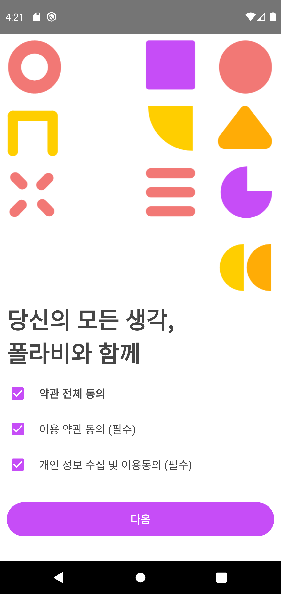
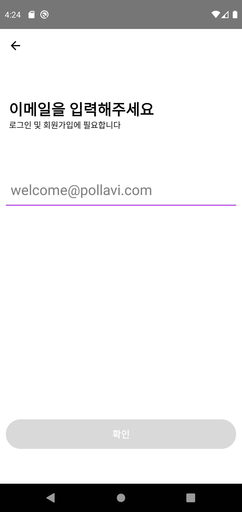
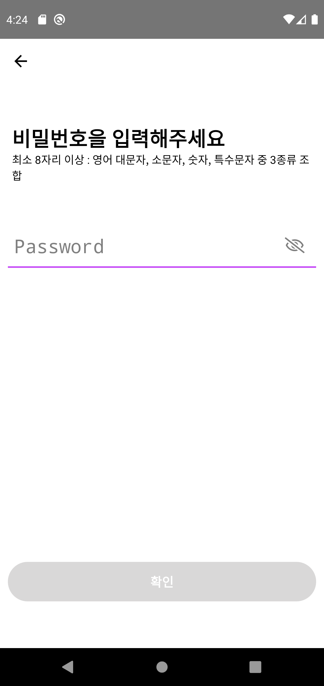
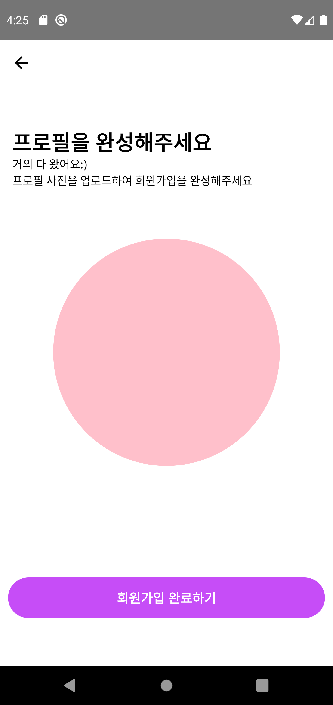
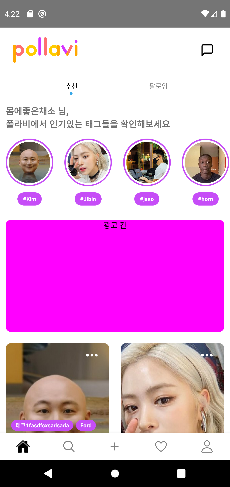
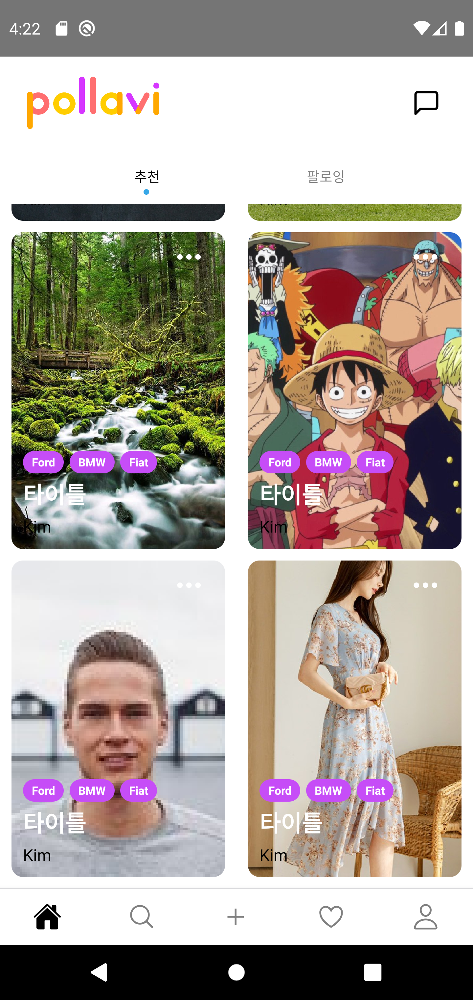
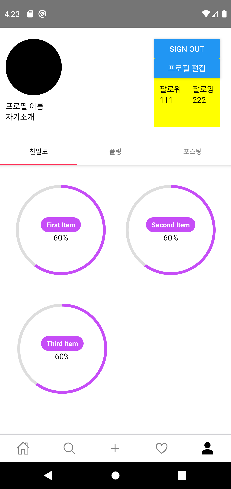

# pollavi-mobile

## Description

Role

> Front-end Development

Development period

> 2020.12. - 2021.08.

### Contests

- 🏅 2020 Kyung Hee University Start Up project

   

### Summary

- Short Form Video SNS app

 
 

## About Project

### Android & IOS App

- React Framwork
- Use javascript language to make more dynamics

   

### Database & Server

- AWS free tier
- MySQL User DB
- Send User information as JSON (NodeJS)

   

   

## Results

### H/W

- Machine

- Circuit

   

### App

|    Function    |                                                                                                               Screen                                                                                                                |
| :------------: | :---------------------------------------------------------------------------------------------------------------------------------------------------------------------------------------------------------------------------------: |
| initial screen |                                                                               |
| SignUp screen  |    |
|  Home screen   |                                                                               |
| Porfile screen |                                                                                                                                                          |

   

   

---

### References

https://reactnavigation.org/

https://oblador.github.io/react-native-vector-icons/

https://www.youtube.com/watch?v=nQVCkqvU1uE&t=252s
https://www.youtube.com/watch?v=nQVCkqvU1uE&t=1416s

