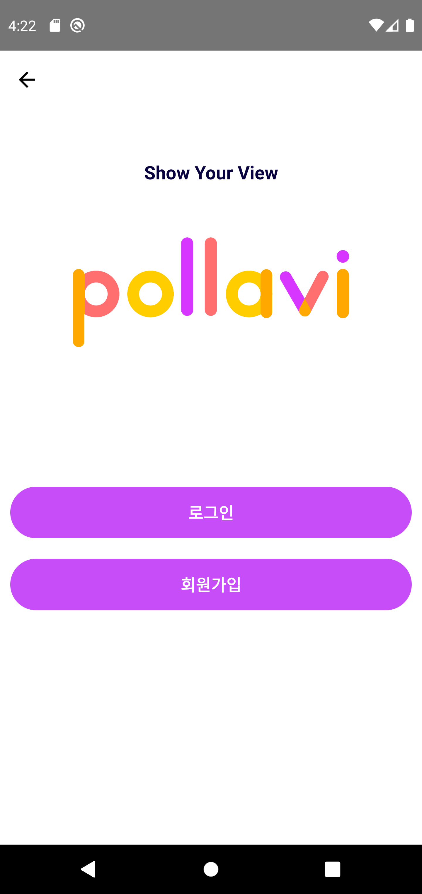

# pollavi-mobile

## Description

Role

> Front-end Development

Development period

> 2020.12. - 2021.08.

### Contests

- 🏅 2020 Kyung Hee University Start Up project

   

### Summary

- Short Form Video SNS app

 
 

## About Project

### Android & IOS App

- 사용자가 입력한 레시피 서버 DB에 저장
- '레시피 실행'과 '바로 실행' 기능 구현
- 실행할 조미료를 서버에 request

   

### Database & Server

- AWS free tier
- MySQL User DB
- send User information as JSON (NodeJS)

   

   

## Results

### H/W

- Machine

- Circuit

   

### App

|     Function     |                                                                         Screen                                                                          |
| :--------------: | :-----------------------------------------------------------------------------------------------------------------------------------------------------: |
|  initial screen  |   |
| 조미료 실행 명령 |                                                                                                       |
|   레시피 추가    |                                                                                                           |

   

   

---

### References

  
 
  
  
  
  
   
  
  

